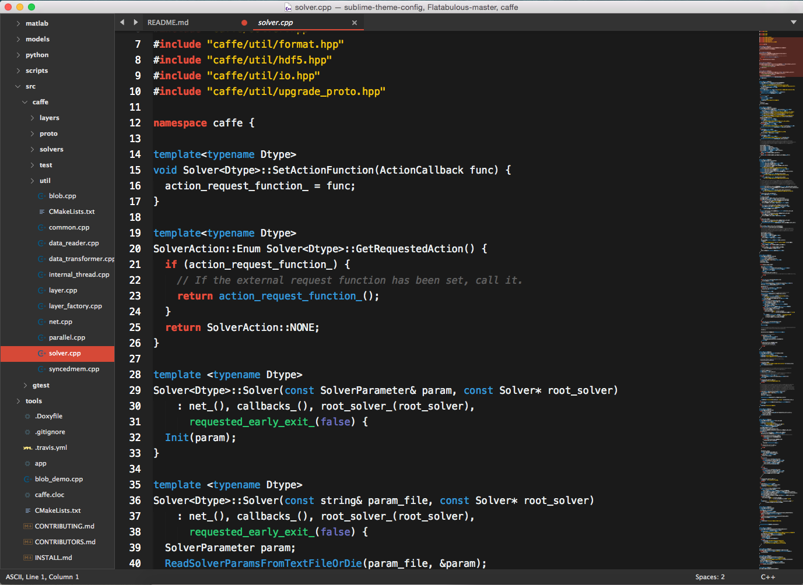

 
It is an instruction about how to configure sublime theme as figure above. The configuration is based on [Numix Theme](https://github.com/nauzethc/sublime-text-numix) and [Brogrammer Theme](https://github.com/kenwheeler/brogrammer-theme).

# Installation

There are three things need configuring: `Theme`, `Sidebar Icon`, and `Color Scheme`

## Numix Theme
- Use `package control` to install `Numix Theme`
- Activate theme by adding `"theme": "Numix Dark.sublime-theme"` to `Preferences -> Settings - User`
- Tab size can be customized by `"tabs_small": true`, `"tabs_medium": true`, or `"tabs_large": true`

## Seti UI Icons
- Download package zip from its [repository](https://github.com/mrmartineau/SetiUI-Icons-Sublime)
- Extract it to your `Packages\User` directory and rename the folder to `Numix Theme`

## Color Scheme
- Use `package control` to install `Brogrammer Theme`
- Activate color scheme by adding `"color_scheme": "Packages/Theme - Brogrammer/brogrammer.tmTheme"` to `Preferences -> Settings - User`